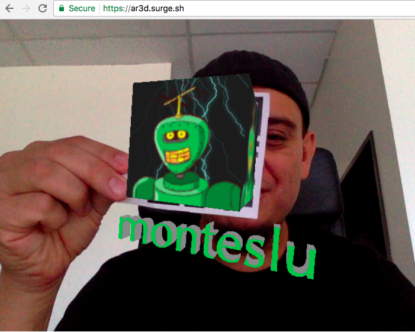

Augmented Reality in 3D with QR codes
=====================================





Simple app to demonstrate Augmented Reality using QR codes.

This app is up and running at: [https://ar3d.surge.sh](https://ar3d.surge.sh)

Fire it up, and hold up a QR code to your webcam.


## Native QR scanning

In order to use the new [Shape Detection API](https://wicg.github.io/shape-detection-api/#barcode-detection-api) as of Chrome 59 you'll need to enable a flag:

In `chrome://flags` enable `Experimental Web Platform features`


This demo will fallback to software detection of QR codes, provided your browser has webcam access at least.

If you're using a browser that doesn't have webcam support, then use a better browser :)


## To build it locally:

```
npm install
npm run build
````

## Run it

```
npm run start
````

## View it

Then view the app:
[http://localhost:3013](http://localhost:3013)
